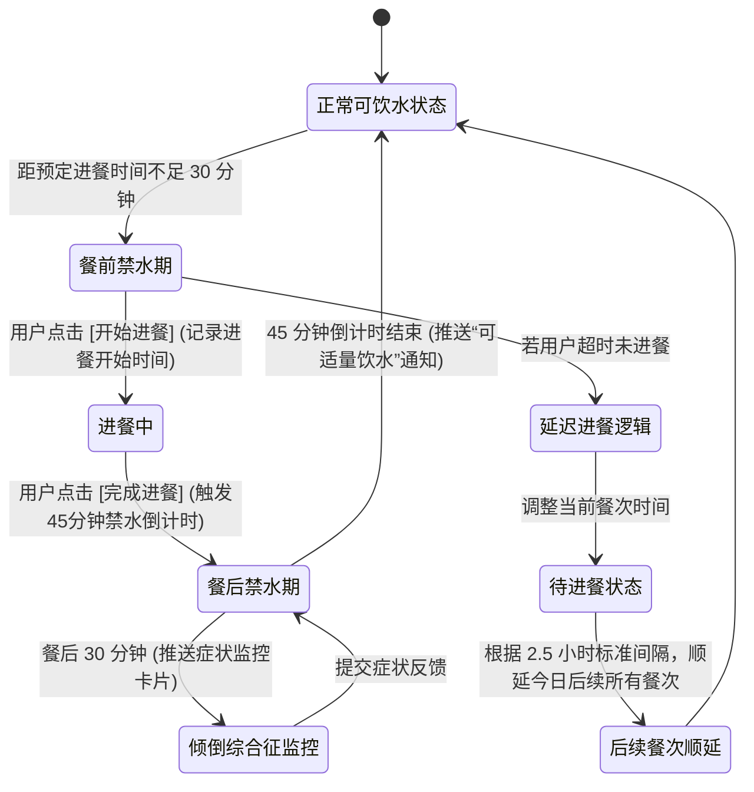

# 全胃切除术后康复管理系统 - 核心业务交付物

## 1. 核心业务流程图（进餐-倒计时-饮水状态机）



## 2. 核心数据库表结构设计 (PostgreSQL Schema)

```sql
-- 1. 用户表 (患者与医生)
CREATE TABLE users (
    id UUID PRIMARY KEY DEFAULT gen_random_uuid(),
    role VARCHAR(20) NOT NULL CHECK (role IN ('PATIENT', 'DOCTOR')),
    name VARCHAR(100) NOT NULL,
    phone VARCHAR(20) UNIQUE,
    surgery_date DATE,                  -- 仅患者: 手术日期
    current_diet_phase VARCHAR(50),     -- 仅患者: 流质/半流质/软食等
    doctor_id UUID REFERENCES users(id),-- 仅患者: 绑定的主治医生
    created_at TIMESTAMP WITH TIME ZONE DEFAULT CURRENT_TIMESTAMP
);

-- 2. 动态食谱方案表 (由后台配置，下发给患者)
CREATE TABLE diet_plans (
    id UUID PRIMARY KEY DEFAULT gen_random_uuid(),
    patient_id UUID REFERENCES users(id) ON DELETE CASCADE,
    plan_date DATE NOT NULL,            -- 食谱归属日期
    meal_index INTEGER NOT NULL,        -- 第几餐 (1-8)
    meal_name VARCHAR(50) NOT NULL,     -- e.g., '早点', '午餐', '加餐'
    scheduled_time TIME NOT NULL,       -- 预定时间
    food_items JSONB NOT NULL,          -- 结构化食材与克重 [{item: '米汤', weight_g: 50}]
    calories_target INTEGER,
    protein_target DECIMAL,
    created_at TIMESTAMP WITH TIME ZONE DEFAULT CURRENT_TIMESTAMP,
    UNIQUE(patient_id, plan_date, meal_index)
);

-- 3. 康复打卡日志表 (记录真实执行情况与时间轴顺延)
CREATE TABLE checkin_logs (
    id UUID PRIMARY KEY DEFAULT gen_random_uuid(),
    patient_id UUID REFERENCES users(id) ON DELETE CASCADE,
    log_type VARCHAR(50) NOT NULL,      -- 'MEAL', 'WATER', 'MEDICATION'
    diet_plan_id UUID REFERENCES diet_plans(id), -- 若为进餐打卡，关联食谱
    actual_start_time TIMESTAMP WITH TIME ZONE,
    actual_end_time TIMESTAMP WITH TIME ZONE,
    delayed_minutes INTEGER DEFAULT 0,  -- 导致后续餐次顺延的分钟数
    volume_ml INTEGER,                  -- 仅饮水打卡: 饮水量
    medication_type VARCHAR(50),        -- 仅药物打卡: e.g., 'B12', '铁剂'
    status VARCHAR(20) DEFAULT 'COMPLETED',
    created_at TIMESTAMP WITH TIME ZONE DEFAULT CURRENT_TIMESTAMP
);

-- 4. 倾倒综合征与异常体征记录表
CREATE TABLE symptom_logs (
    id UUID PRIMARY KEY DEFAULT gen_random_uuid(),
    patient_id UUID REFERENCES users(id) ON DELETE CASCADE,
    related_meal_log_id UUID REFERENCES checkin_logs(id), -- 溯源对应的上一餐
    symptom_type VARCHAR(50) NOT NULL,  -- 'DUMPING_SYNDROME', 'BLOATING' 等
    severity_level INTEGER NOT NULL CHECK (severity_level BETWEEN 0 AND 3), -- 0无, 3严重
    symptom_details JSONB,              -- {'palpitations': true, 'sweating': false}
    timestamp TIMESTAMP WITH TIME ZONE DEFAULT CURRENT_TIMESTAMP
);

-- 5. 每日体征流水表 (体重、排便等)
CREATE TABLE vitals_logs (
    id UUID PRIMARY KEY DEFAULT gen_random_uuid(),
    patient_id UUID REFERENCES users(id) ON DELETE CASCADE,
    log_date DATE NOT NULL,
    weight_kg DECIMAL,
    bristol_score INTEGER CHECK (bristol_score BETWEEN 1 AND 7), -- 布里斯托大便评分
    created_at TIMESTAMP WITH TIME ZONE DEFAULT CURRENT_TIMESTAMP
);
```
